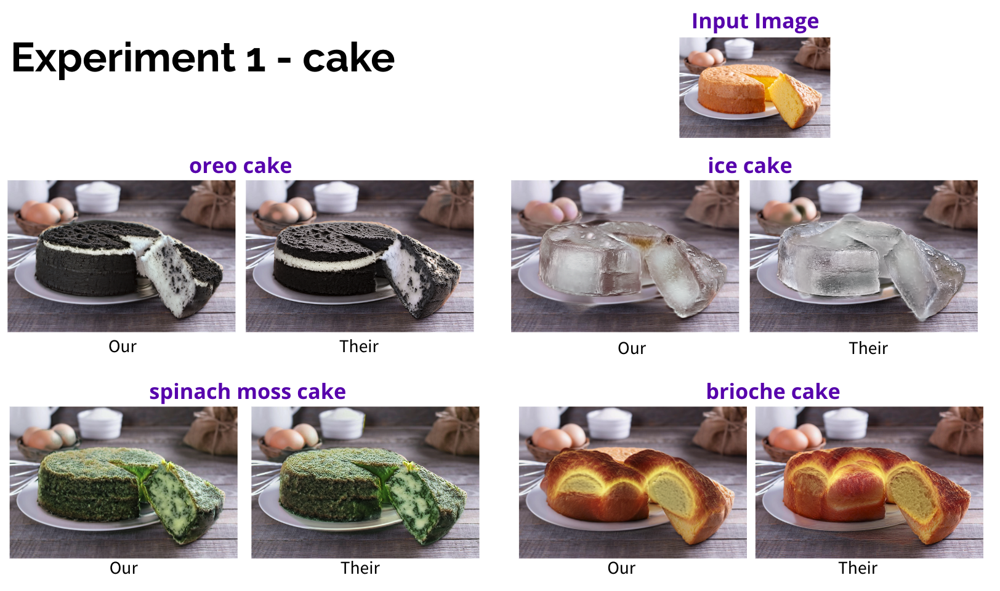
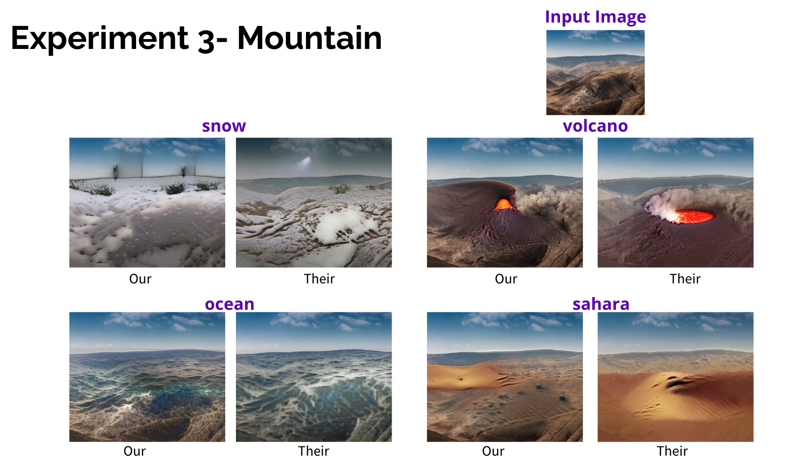
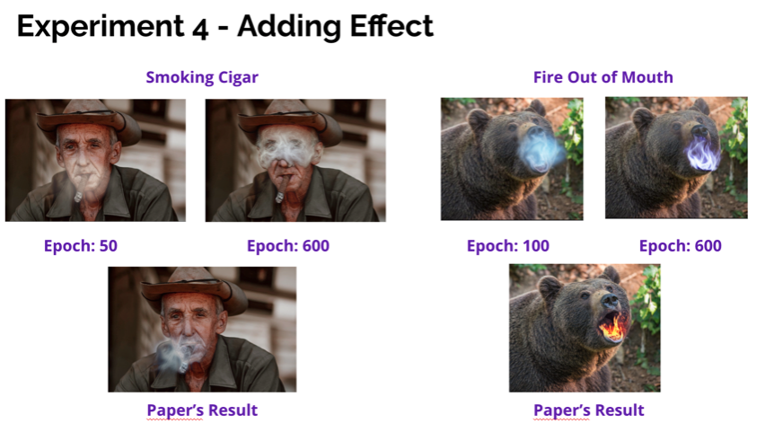
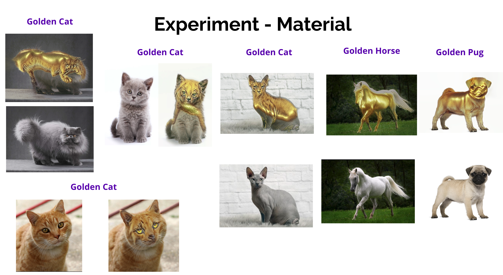
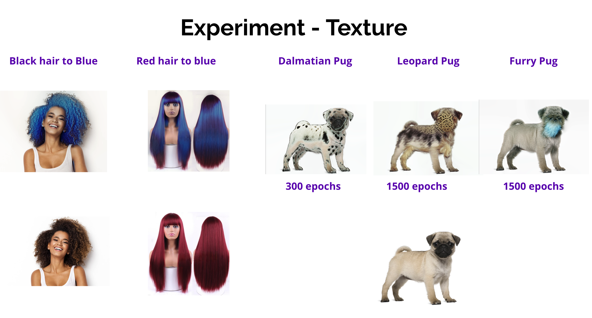
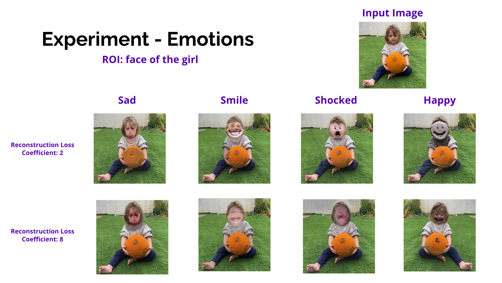
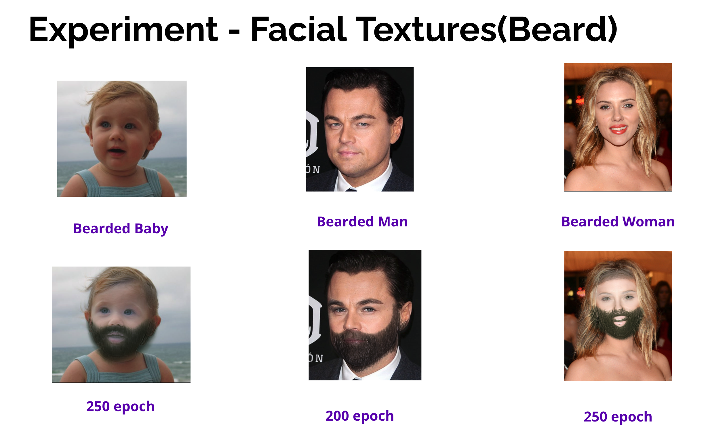
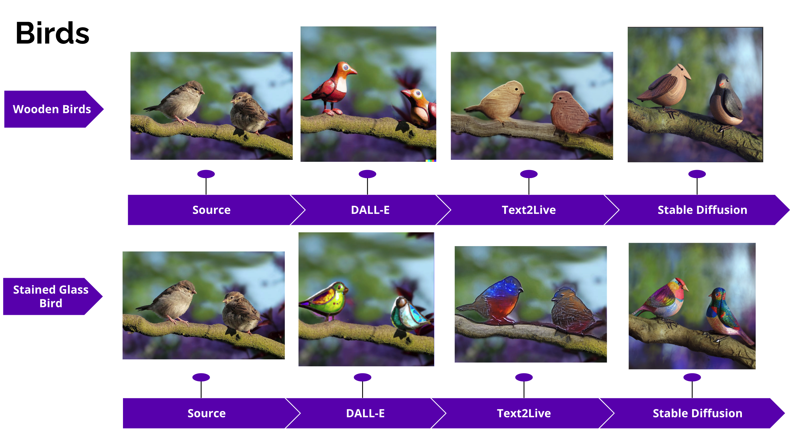
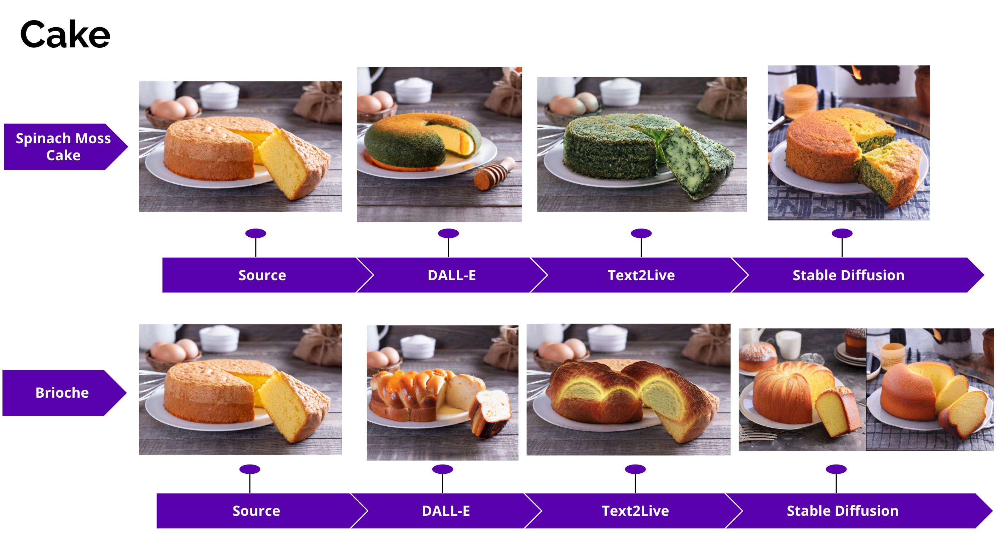
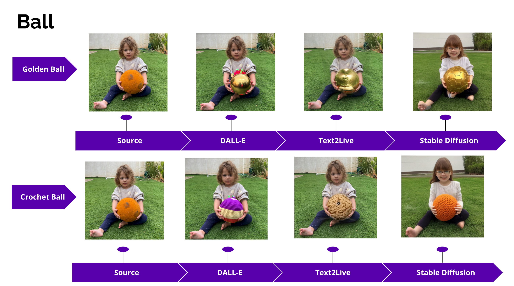

# This repo is created for ML Reproducibility Challenge 2022 

This repository is a replication implementation of [Text2LIVE: Text-Driven Layered Image and Video Editing (ECCV 2022 - Oral)](https://arxiv.org/abs/2204.02491) as part of the ML [Reproducibility Challenge 2021](https://paperswithcode.com/rc2022). 


In this repository, edited code of Text2LIVE for ML Reproducibility Challenge 2022 is presented. Some results of the experiments and adjusted hyperparameters settings are given. Furthermore, summary of the investigations and foundings can be found in this README.md file.

## Requirements

To install requirements:

```setup
pip install -r requirements.txt
```

## Training

#### Video Editing
Run the following command to start training
```
python train_video.py --example_config car-turn_winter.yaml
```
#### Image Editing
Run the following command to start training
```
python train_image.py --example_config golden_horse.yaml
```
Intermediate results will be saved to `results` during optimization. The frequency of saving intermediate results is indicated in the `log_images_freq` flag of the configuration.

## Results

### Reproduced Experiments

Even though our GPU limitations, the model was found to be capable of the claims of the paper. Specifically, it was able to manipulate images in a semantically related and localized manner, without the need for handcrafted masks. The objective function was also able to effectively guide the localization of the generated edit. In addition, the model was able to successfully change textures and apply semi-transparent effects, as demonstrated by the outcomes of the experiments. Overall, these results support the effectiveness of the proposed method for text-driven and zero-shot image manipulation.

<p align="center">
  
  
</p>

<p align="center">
  
  
</p>

### Additional Experiments

We investigated the asnwers of questions such as:

* What is the model's performance on applying material edits on non-smooth surfaces like fur?
* Does the color/texture similarity of the image and edit affects the performance of the edits?
* Does semantically related edits increase the performance? Or semantically meaningless edits drop the performance?
* Is the model able to perform reliable edits on complex structures like the human face? Does it preserve the facial structure of the human?

<p align="center">
  
  
</p>

<p align="center">
  
  
</p>

In conclusion, we have seen that model performance is not as good as in complex surfaces as it is in smooth ones. It is also seen that results are better with the semantically related edits which can be seen from the beard edits and dalmatian texture examples.In addition, when performing emotional edits performance dramatically drops. 

### Comparisons with other generative methods

Results are compared with DALL-E and Stable Diffusion. For DALL-E, masks are provided by the user.

<p align="center">
  
  
  
</p>

## Acknowledgement

Link to Text2LIVE: [arxiv](https://arxiv.org/abs/2204.02491)

For more see the [supplementary material](https://text2live.github.io/sm/index.html).


## Citation
```
@article{bar2022text2live,
         title     = {Text2LIVE: Text-Driven Layered Image and Video Editing},
         author    = {Bar-Tal, Omer and Ofri-Amar, Dolev and Fridman, Rafail and Kasten, Yoni and Dekel, Tali},
         journal   = {arXiv preprint arXiv:2204.02491},
         year      = {2022}
}
```
